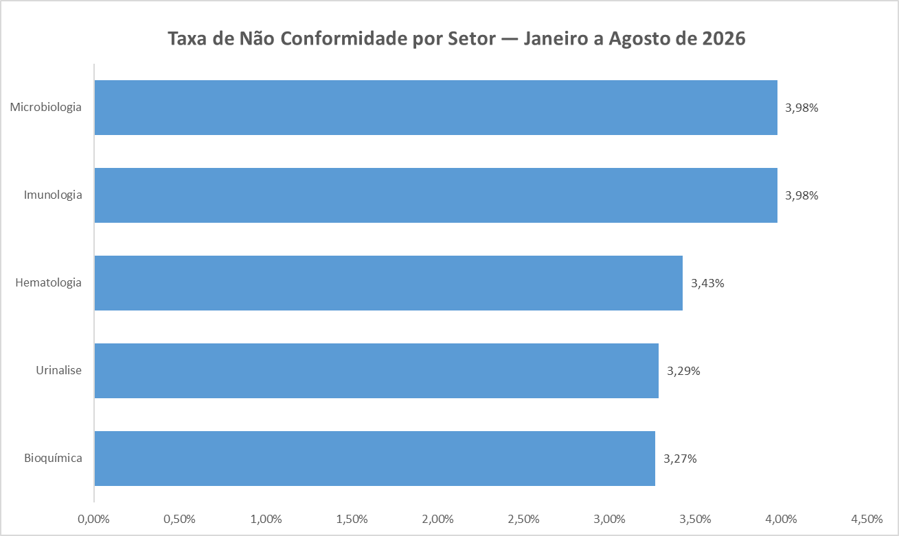
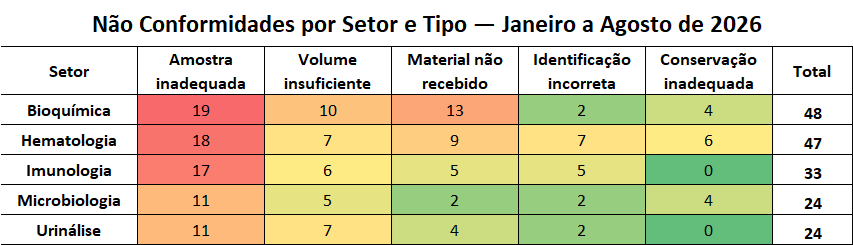
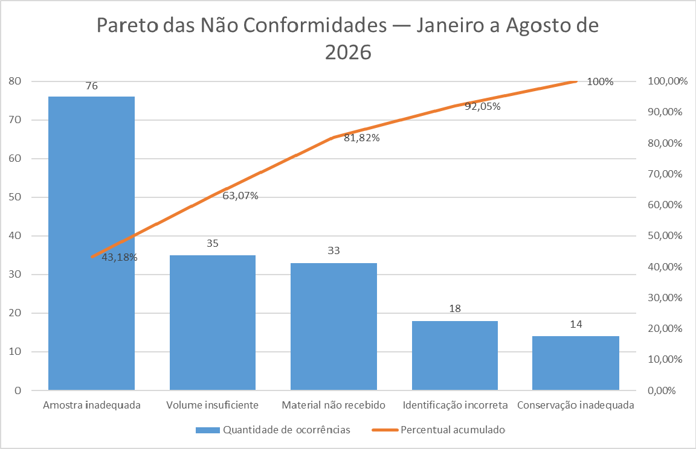
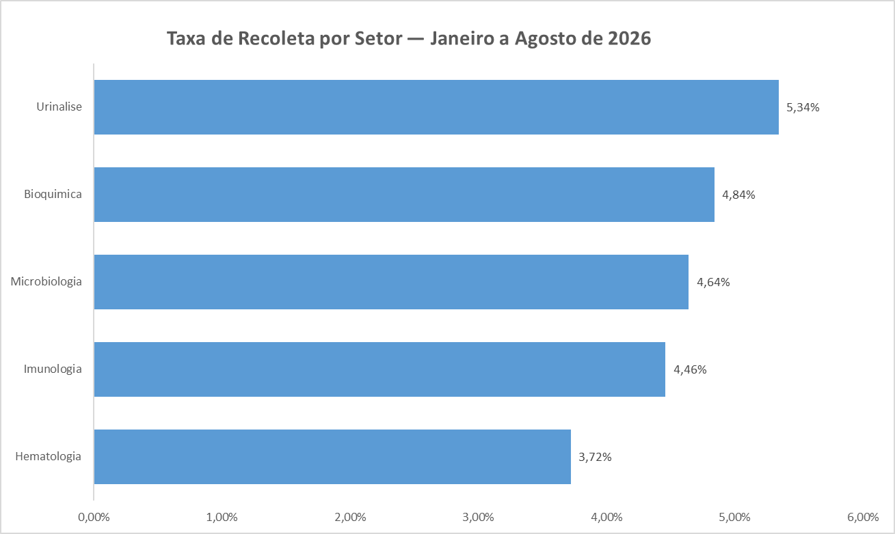
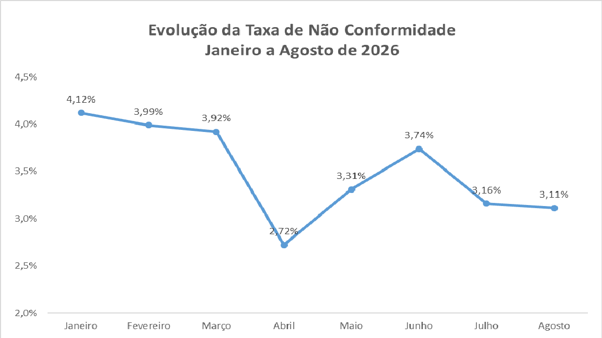

# Dashboard de Qualidade Laboratorial

Projeto de análise de dados aplicado à **Gestão da Qualidade em Laboratório Clínico**, utilizando SQL e SQLite para análise de indicadores e identificação de oportunidades de melhoria.

## Objetivo

Analisar dados laboratoriais e indicadores de qualidade, utilizando técnicas de análise de dados para identificar padrões, principais não conformidades e sua distribuição entre os setores.

## Período analisado

**Janeiro a Agosto de 2026**

## Principais indicadores

- **Total de exames:** 5.000
- **Total de não conformidades:** 176
- **Taxa geral de não conformidade:** 3,52%
- **Total de recoletas:** 226
- **Taxa geral de recoleta:** 4,52%

### Não conformidades por tipo

| Tipo de não conformidade | Quantidade | Percentual |
| ------------------------ | ---------: | ---------: |
| Amostra inadequada       |         76 |     43,18% |
| Volume insuficiente      |         35 |     19,89% |
| Material não recebido    |         33 |     18,75% |
| Identificação incorreta  |         18 |     10,23% |
| Conservação inadequada   |         14 |      7,95% |

As três principais categorias representam **81,82%** das não conformidades registradas no período.

## Análises realizadas

### 1. Análise por setor

A análise por setor permite comparar o volume de exames e a taxa de não conformidade entre as diferentes áreas do laboratório.



| Setor         | Total de exames | Não conformidades |  Taxa |
| ------------- | --------------: | ----------------: | ----: |
| Microbiologia |             603 |                24 | 3,98% |
| Imunologia    |             829 |                33 | 3,98% |
| Hematologia   |           1.371 |                47 | 3,43% |
| Urinálise     |             730 |                24 | 3,29% |
| Bioquímica    |           1.467 |                48 | 3,27% |

### 2. Não conformidades por setor e tipo

Foi realizada uma análise cruzada entre os setores e os tipos de não conformidade, permitindo identificar quais ocorrências são mais frequentes em cada área.



### 3. Análise de Pareto

A análise de Pareto permite identificar as categorias que concentram a maior parte das não conformidades.



As três principais categorias — **amostra inadequada, volume insuficiente e material não recebido** — representam **81,82%** das não conformidades.

### 4. Taxa de recoleta

Foram registradas **226 recoletas em 5.000 exames**, resultando em uma taxa geral de recoleta de **4,52%**.

A análise permite acompanhar a ocorrência de recoletas de forma geral e por setor, contribuindo para o monitoramento dos indicadores de qualidade laboratorial.



| Setor | Total de exames | Recoletas | Taxa de recoleta |
|---|---:|---:|---:|
| Urinálise | 730 | 39 | 5,34% |
| Bioquímica | 1.467 | 71 | 4,84% |
| Microbiologia | 603 | 28 | 4,64% |
| Imunologia | 829 | 37 | 4,46% |
| Hematologia | 1.371 | 51 | 3,72% |

### 5. Evolução mensal

A evolução mensal permite acompanhar a variação da taxa de não conformidade ao longo do período analisado.



| Mês       | Total de exames | Não conformidades |  Taxa |
| --------- | --------------: | ----------------: | ----: |
| Janeiro   |             679 |                28 | 4,12% |
| Fevereiro |             601 |                24 | 3,99% |
| Março     |             664 |                26 | 3,92% |
| Abril     |             624 |                17 | 2,72% |
| Maio      |             605 |                20 | 3,31% |
| Junho     |             615 |                23 | 3,74% |
| Julho     |             602 |                19 | 3,16% |
| Agosto    |             610 |                19 | 3,11% |

Entre janeiro e agosto, a taxa de não conformidade passou de **4,12% para 3,11%**.

## Estrutura do projeto

```text
dashboard-qualidade-laboratorial/
│
├── README.md
│
sql/
├── 01_analise_setores.sql
├── 02_setor_tipo_nao_conformidade.sql
├── 03_pareto.sql
├── 04_evolucao_mensal.sql
└── 05_taxa_recoleta.sql
│
├── resultados/
│   └── indicadores.md
│
└── graficos/
    ├── pareto_nao_conformidades.md
    ├── pareto_nao_conformidades.png
    ├── taxa_nao_conformidade_setor.png
    ├── taxa_recoleta_setor.png
    ├── evolucao_taxa_nao_conformidade.png
    └── nao_conformidades_setor_tipo.png
```

## Tecnologias utilizadas

* **SQLite**
* **SQL**
* **GitHub**
* **Excel** para criação das visualizações

## Observação sobre os dados

Os dados utilizados neste projeto são destinados à demonstração de análise de dados e gestão da qualidade. Dados publicados em repositórios devem ser anonimizados e não devem conter informações que permitam a identificação de pacientes.

## Próximas análises

- Desenvolvimento de novos indicadores de qualidade
- Expansão do dashboard com novas visualizações

## Autor

**Lais Ferreira Silva**

Projeto desenvolvido para portfólio na área de **Análise de Dados**, com aplicação prática em **Gestão da Qualidade Laboratorial**.
